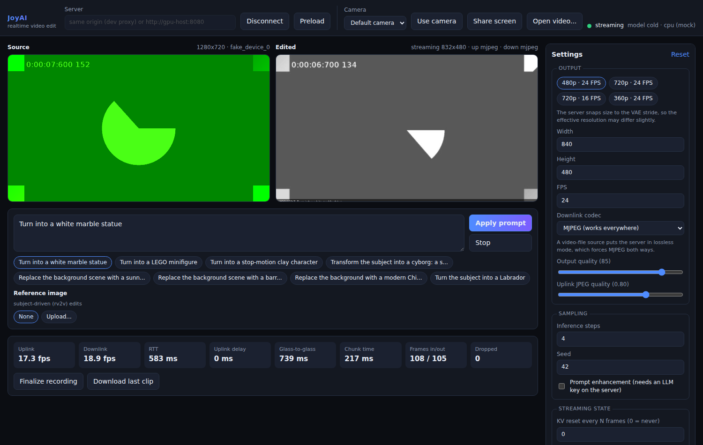

# JoyAI Realtime Video Edit — Webapp

A browser console for [JoyAI-Video-Edit](https://github.com/jd-opensource/JoyAI-Video-Edit),
JD's real-time streaming video-to-video editing model.

You point a camera (or a screen share, or a video file) at it, type an instruction
like *"Turn into a white marble statue"*, and edited frames stream back live.
The webapp is a pure client: it speaks JoyAI's WebSocket protocol and holds no
model of its own.



*(Screenshot is the app running against the bundled mock server with Chromium's
synthetic camera — hence the green test pattern.)*

## What's here

| Path | What it is |
| --- | --- |
| `web/` | React + TypeScript + Vite frontend — the editing console |
| `mock-server/` | Protocol-accurate mock of the JoyAI server, for GPU-free development |
| `docs/PROTOCOL.md` | The JoyAI streaming protocol, as implemented here |

## Quick start (no GPU)

The mock server implements the same routes, control messages and framing as the
real thing, substituting cheap PIL filters for the 16B diffusion transformer.
It is enough to develop and test the entire client.

```bash
# 1. mock backend on :8080
python3 -m venv .venv && .venv/bin/pip install -r mock-server/requirements.txt
.venv/bin/python mock-server/server.py --port 8080

# 2. frontend on :5173 (proxies /ws and the HTTP routes to :8080)
cd web && npm install && npm run dev
```

Open http://localhost:5173, click **Connect**, then **Use camera**, then
**Start editing**.

## Running against a real JoyAI server

Deploy JoyAI itself first — it needs ~51 GB of checkpoints and a Blackwell-class
GPU (B200, RTX PRO 6000). Follow its `DEPLOYMENT.md`; the server listens on
`0.0.0.0:8080`.

Then either:

- **Type the address into the app.** Put `http://gpu-host:8080` in the *Server*
  field. The server must allow cross-origin WebSockets, or you must tunnel it.
- **Proxy it in dev** (no CORS concerns), which is the smoother path:

  ```bash
  # SSH tunnel if the GPU box is remote
  ssh -N -L 8080:127.0.0.1:8080 user@gpu-host

  cd web && JOYAI_ORIGIN=http://127.0.0.1:8080 npm run dev
  ```

  Leave the *Server* field blank so the app uses the same origin.
- **Serve the built app from the GPU box**, replacing JoyAI's bundled UI:

  ```bash
  cd web && npm run build
  # copy web/dist to the server and point deploy/static at it,
  # or serve it with any static host on the same origin as :8080
  ```

Browsers only grant camera access on `https://` or `localhost`, so for a remote
server prefer the tunnel or terminate TLS in front of it.

## Features

- **Sources** — webcam (with device picker), screen share, or a local video file.
  A file source puts the server into lossless mode, which forces MJPEG both ways.
- **Prompting** — free text plus one-click presets, reference-image upload for
  subject-driven (rv2v) edits, and the server's reference images when it exposes
  them. `Cmd/Ctrl+Enter` applies. Changing the prompt restarts the session in
  place without dropping the connection.
- **Live output** — source and edited views side by side, MJPEG or H.264
  (H.264 decodes through WebCodecs and falls back to MJPEG where unavailable).
- **Settings** — resolution/FPS presets matching JoyAI's per-GPU guidance,
  inference steps, seed, output and uplink quality, KV-cache reset cadence,
  max temporal IDs, static-scene KV freezing, and the face/person presence gate.
- **Telemetry** — uplink/downlink FPS, WebSocket RTT, server-estimated uplink
  delay, glass-to-glass latency, server-side frame counters, and chunks dropped
  to congestion.
- **Recording** — finalize and download the server's recording when it was
  launched with `JOYOMNI_RECORD_DIR`.

## How it works

```
camera/file ──▶ <video> ──▶ canvas ──▶ JPEG ──┐
                                              │  WebSocket /ws
                                              ▼
                                      JoyAI streaming server
                                              │
   canvas ◀── ImageBitmap / VideoDecoder ◀─────┘  output_frame + binary
```

Three pieces carry the design:

- **`web/src/protocol/`** — typed wire contract and the `JoyAIClient` transport.
  The client owns the socket, pairs each `output_frame` header with the binary
  frame that follows it, and runs the ack/ping loops. It knows nothing about
  codecs or rendering.
- **`web/src/media/`** — capture, JPEG encoding for the uplink, and MJPEG/H.264
  decoding for the downlink.
- **`web/src/state/useSession.ts`** — orchestration: the capture loop, uplink
  backpressure, renderer lifecycle, and stats.

Two behaviours are easy to get wrong and worth knowing about:

- **The server drops the session after 10 s of silence.** The client pings every
  second regardless of whether frames are flowing.
- **The server's congestion controller needs acks.** Without a steady `ack`
  reporting how many output frames arrived, it assumes the client is drowning
  and drops entire output chunks. The client acks every 250 ms.

The client also caps its own uplink queue at half a second of frames. Anything
queued ahead of the server is pure added latency; in testing, removing that cap
roughly doubled glass-to-glass time.

The server has the final say on session parameters — it snaps resolution to the
VAE stride and may refuse the codec you asked for — so the renderer and encoder
are configured from its `started` reply, not from the requested settings.

## Tests

```bash
cd web
npm run build                       # typecheck + production build
npm run e2e                         # drives the app in Chromium, synthetic camera
```

`npm run e2e` expects the app served at `http://127.0.0.1:8099/` by default:

```bash
npm run build
.venv/bin/python ../mock-server/server.py --port 8099 --static-dir dist
E2E_URL=http://127.0.0.1:8099/ npm run e2e
```

It asserts frames round-trip, the output canvas is genuinely painted, and the
console stays clean. Set `E2E_CHROMIUM` to use a pre-installed Chromium.

## Limitations

- The mock server is a development aid, not a model. Its output is watermarked
  `MOCK EDIT` so it is never mistaken for a real result, and it always speaks
  MJPEG (the H.264 downlink path only exercises against a real server).
- `Download last clip` requires the real server to be running with a recording
  directory configured; the mock returns a 404 by design.
- Prompt enhancement needs an `OPENAI_API_KEY` on the JoyAI server; the toggle
  is inert without one.

## Licence

JoyAI-Video-Edit is Apache-2.0. This webapp is an independent client for it.
